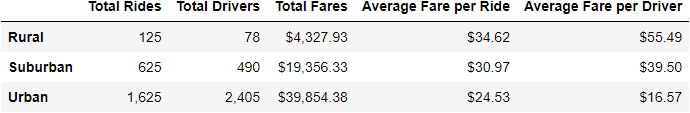
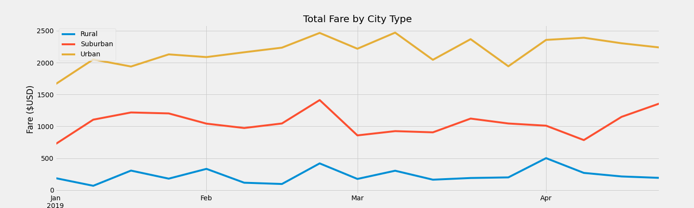

# PyBer_Analysis

## Overivew
Ride-share company 'Pyber' has asked for a summary of weekly fares on weekly basis, per city type. Dataframe summary will be indexed based on three city types:
1. Urban
2. Suburban
3. Rural

And will include the following metrics:
1. Total Rides
2. Total Drivers
3. Total Fares
4. Average Fares per Ride
5. Average Fare per Driver
6. Total Fares by City Type

## Resources
- Data Sources: 
  - city_data.csv
  - ride_data.csv        
- Software: Python 3.7.10, Anaconda 4.10.1

## Results
### Pyber Summary Data Frame

### Total Fares by City Type

## Summary
Based on this analysis, there is a clear disparity on average fares for riders in rural areas ($34.62) vs. urban areas ($24.53). The total fare in rural areas was never higher in any week between January 2019 through April 2019 than any other city type. Lastly, the drivers the average fare per driver in rural areas was much higher ($55.49) than any other city type. There are a few recommendations to address these disparities:
1. Provide discount rates for rural areas to help mitigate lack of drivers.
2. Incentivize drivers in rural areas to increase the total amount of drivers and help decrease fare costs for riders.
3. Further analysis can be done to determine distance or time spent vs. fares to find ways to balance disparities among different city types.  
